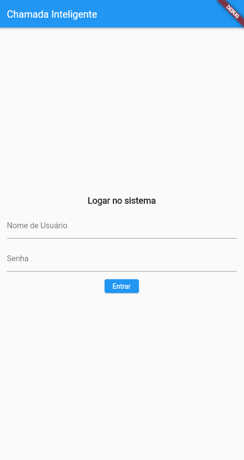
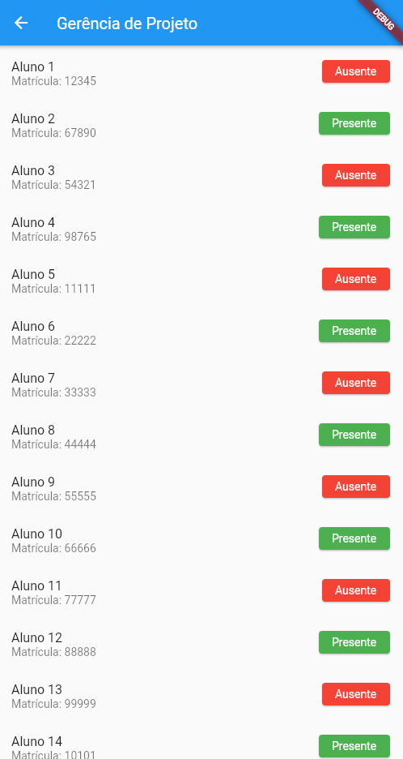

# Chamada Inteligente

Projeto de desenvolvimento do aplicativo de Chamada Inteligente, na qual visa simplificar o processo de chamada. A partir de um sistema inteligente que permite o registro da presença de forma tecnológica.

Para mais informações a respeito do Sistema de [Chamada Inteligente](https://leomurta.github.io/courses/es2/trabalho_chamada.pdf).

## 1. Pré-Requisitos

- Flutter 3.13.5
- Android SDK v34.0.0
- Android Studio v2022.3

## 2. Instale as dependências  

```bash
flutter doctor
```

## 3. Interaja com a aplicação

```bash
flutter run
```

## 4. Telas Iniciais da Aplicação
### Login no Sistema


### Turmas ministradas pelo professor


### Disciplinas do aluno


### Gerenciamento da chamada pelo professor


## Colaboradores

<table>
  <tr>
    <td align="center">
      <a href="https://www.linkedin.com/in/joao-victor-albuquerque/">
        <br>
        <sub>
          <b>João Victor Albuquerque</b>
        </sub>
      </a>
    </td>
    <td align="center">
      <a href="https://www.linkedin.com/in/heron-lancellot">
        <br>
        <sub>
          <b>Heron Lancellot</b>
        </sub>
      </a>
    </td>
    <td align="center">
      <a href="https://www.linkedin.com/in/savio-suhett/">
        <br>
        <sub>
          <b>Savio Suhett</b>
        </sub>
      </a>
    </td>
        <td align="center">
      <a href="https://www.linkedin.com/in/sabrinapsuzuki/">
        <br>
        <sub>
          <b>Sabrina Suzuki</b>
        </sub>
      </a>
    </td>
        </td>
        <td align="center">
      <a href="https://github.com/felipeSepulvida">
        <br>
        <sub>
          <b>Felipe Sepulvida</b>
        </sub>
      </a>
    </td>
        </td>
        <td align="center">
      <a href="https://github.com/lpmleo">
        <br>
        <sub>
          <b>Leonardo Menezes</b>
        </sub>
      </a>
    </td>
  </tr>
</table>